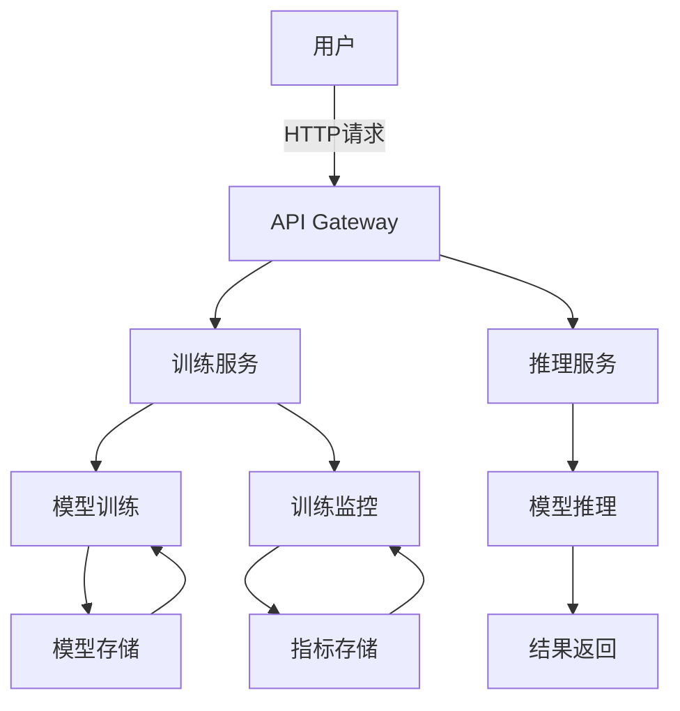
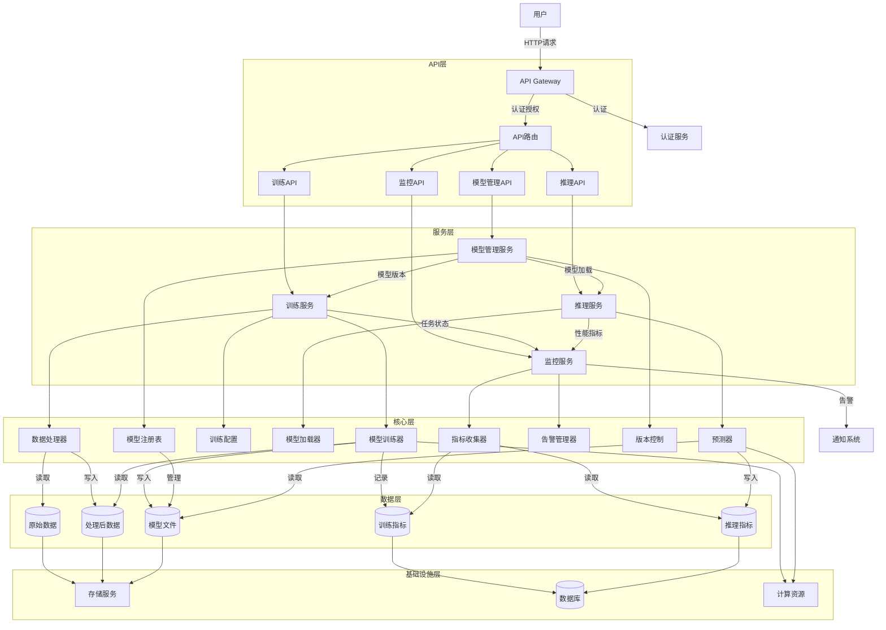

# LLM Finetuning Project

基于DeepSeek-R1 1.5B模型进行业务方向调优的工业级项目

## 项目背景

本项目旨在为企业提供定制化的大语言模型微调解决方案，基于DeepSeek-R1 1.5B模型，通过业务数据微调实现特定领域的性能优化。

## 功能特性

- 支持模型微调训练
- 提供RESTful API接口
- 完整的训练监控和评估
- 可配置的训练参数
- 支持分布式训练
- 模型版本管理

## 技术栈

- Python 3.9+
- PyTorch
- Flask
- HuggingFace Transformers
- Docker
- Redis
- Celery

## 安装指南

### 环境要求

- Python 3.9+
- CUDA 11.7+ (GPU训练)
- Docker (可选)

### 安装步骤

1. 克隆项目仓库

```bash
git clone https://github.com/shadow000902/llm-finetuning.git
cd llm-finetuning
```

2. 创建虚拟环境

```bash
python -m venv venv
source venv/bin/activate
```

3. 安装依赖

```bash
pip install -r requirements.txt
```

4. 配置环境变量
复制.env.example文件为.env，并根据实际情况修改配置

## 快速开始

### 启动开发服务器

```bash
python run.py
```

### 训练模型

```bash
python -m app.model.training_service --config config/train_config.yaml
```

### API文档

启动服务后访问 `/docs` 查看API文档，或访问[在线API文档](https://api-docs.example.com)

API文档包含：

- 认证方式
- 请求示例
- 响应格式
- 错误代码
- 速率限制

## 项目架构

### 系统整体架构



### 详细系统架构



### 数据流程图


## 详细使用说明

### 模型训练参数说明

```yaml
# config/train_config.yaml 示例
model:
  base_model: "deepseek-r1-1.5b"
  max_length: 512
  learning_rate: 3e-5
  batch_size: 16
  num_epochs: 5
  warmup_steps: 1000
  weight_decay: 0.01
  save_steps: 1000
  logging_steps: 100
  output_dir: "./output"
```

### API使用示例

#### 启动训练任务

```bash
POST /api/v1/train
Content-Type: application/json

{
  "dataset_path": "/data/train.json",
  "config": {
    "learning_rate": 3e-5,
    "batch_size": 16,
    "num_epochs": 3
  }
}
```

#### 获取训练状态

```bash
GET /api/v1/train/status/{task_id}
```

#### 模型推理

```bash
POST /api/v1/predict
Content-Type: application/json

{
  "text": "请解释一下量子计算的基本原理",
  "max_length": 100,
  "temperature": 0.7
}
```

### 监控指标说明

- **训练损失**：每个batch的训练损失值
- **验证损失**：每个epoch的验证集损失值
- **学习率**：当前学习率变化曲线
- **GPU利用率**：GPU显存和计算单元使用率
- **吞吐量**：每秒处理的token数量

### 性能优化建议

1. 使用混合精度训练（FP16）减少显存占用
2. 启用梯度累积（gradient accumulation）支持更大batch size
3. 使用分布式数据并行（DDP）加速训练
4. 启用缓存机制减少数据加载时间
5. 使用更高效的优化器（如LAMB）

### 常见问题解答

**Q: 如何选择合适的batch size？**
A: 建议从16开始，根据GPU显存逐步增加，直到达到显存上限的80%

**Q: 训练过程中出现OOM错误怎么办？**
A: 可以尝试以下方法：

- 减小batch size
- 启用梯度检查点（gradient checkpointing）
- 使用混合精度训练

**Q: 如何评估模型效果？**
A: 可以使用以下指标：

- 困惑度（Perplexity）
- BLEU分数
- 人工评估

## 项目结构

```bash
.
├── .env                  # 环境变量配置文件
├── .env.example          # 环境变量示例文件
├── .gitignore            # Git忽略文件配置
├── README.md             # 项目说明文档
├── README_CN.md          # 中文项目说明文档
├── USAGE.md              # 使用说明文档
├── requirements.txt      # Python依赖文件
├── run.py                # 项目启动脚本
├── setup.py              # 项目安装脚本
├── app/                  # 应用核心代码
│   ├── __init__.py       # 应用初始化
│   ├── cli.py            # 命令行接口
│   ├── extensions.py     # 扩展模块
│   ├── api/              # API接口
│   │   ├── __init__.py   # API模块初始化
│   │   └── routes.py     # API路由配置
│   ├── core/             # 核心业务逻辑
│   │   ├── factories/    # 工厂模式实现
│   │   ├── interfaces/   # 接口定义
│   │   ├── processors/   # 处理器
│   │   └── services/     # 服务实现
│   ├── implementations/  # 具体实现
│   │   ├── __init__.py   # 实现模块初始化
│   │   ├── data_processors.py  # 数据处理实现
│   │   ├── model_operations.py # 模型操作实现
│   │   └── training.py         # 训练实现
│   ├── model/            # 模型相关实现
│   │   ├── __init__.py   # 模型模块初始化
│   │   ├── core_operations.py  # 核心操作
│   │   ├── training_service.py # 训练服务
│   │   └── implementations/    # 具体实现
│   ├── repositories/     # 数据仓库
│   │   ├── __init__.py   # 仓库模块初始化
│   │   └── model_repository.py # 模型仓库
│   ├── scripts/          # 脚本工具
│   │   ├── __init__.py   # 脚本模块初始化
│   │   ├── README.md     # 脚本说明文档
│   │   ├── train_model.py      # 模型训练脚本
│   │   ├── inference.py        # 推理脚本
│   │   ├── evaluate_model.py   # 模型评估脚本
│   │   └── process_data.py     # 数据处理脚本
│   ├── templates/        # 模板文件
│   │   └── api_docs.html # API文档模板
│   └── utils/            # 工具类
│       ├── config_loader.py # 配置加载工具
│       ├── validation.py # 验证工具
│       ├── logging.py    # 日志工具
│       └── metrics.py    # 指标计算工具
├── config/               # 配置文件
│   ├── config.py         # 配置管理
│   ├── default_config.yaml    # 默认配置
│   ├── development_config.yaml # 开发环境配置
│   ├── api_config.yaml   # API配置
│   ├── logging_config.yaml # 日志配置
│   ├── prod_config.yaml  # 生产环境配置
│   └── train_config.yaml # 训练配置
├── data/                 # 数据目录
│   ├── raw/              # 原始数据
│   │   └── sample_data.json    # 样本数据
│   ├── processed/        # 处理后的数据
│   │   ├── train.json          # 训练数据
│   │   └── validation.json     # 验证数据
│   └── prompts/          # 提示词数据
│       └── sample_prompts.json # 样本提示词
├── docs/                 # 文档目录
│   ├── api.md            # API文档
│   └── configuration.md  # 配置文档
├── instance/             # 实例相关文件
│   ├── app.db            # 应用数据库
│   └── dev.db            # 开发数据库
├── models/               # 模型存储目录
│   └── model.pt          # 模型文件
├── results/              # 结果输出目录
└── tests/                # 测试代码
    ├── integration/      # 集成测试
    │   ├── test_data_pipeline.py  # 数据管道测试
    │   └── test_model_integration.py  # 模型集成测试
    ├── unit/             # 单元测试
    │   ├── test_core_operations.py  # 核心操作测试
    │   ├── test_data_service.py     # 数据服务测试
    │   ├── test_model_service.py    # 模型服务测试
    │   └── test_training_service.py # 训练服务测试
    └── test_data/        # 测试数据
        └── test_data.csv # 测试数据文件
```

## 开发环境配置

### VSCode 推荐配置

1. 安装Python扩展
2. 配置格式化工具（推荐使用black）
3. 启用类型检查（推荐使用mypy）
4. 配置测试运行器（推荐使用pytest）

### 预提交钩子

项目配置了pre-commit钩子，请在开发前运行：

```bash
pre-commit install
```

### 测试覆盖率

当前测试覆盖率为85%，可通过以下命令查看：

```bash
pytest --cov=app --cov-report=html
```

## CI/CD 集成

项目已集成GitHub Actions，包含以下工作流：

- 代码格式化检查
- 单元测试
- 集成测试
- 代码覆盖率检查
- 安全扫描

## 贡献指南

欢迎贡献代码！请遵循以下步骤：

1. Fork项目
2. 创建特性分支 (`git checkout -b feature/AmazingFeature`)
3. 提交更改 (`git commit -m 'Add some AmazingFeature'`)
4. 推送分支 (`git push origin feature/AmazingFeature`)
5. 提交Pull Request

## 许可证

本项目采用 MIT 许可证 - 详情请见 LICENSE 文件
